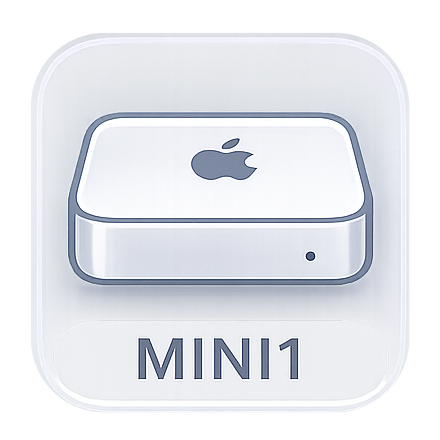

# Icon 资源库

这是一个用于存放项目图标（Icon）及相关图片资源的仓库。

## 包含的图标文件

以下是当前仓库中存放的图标文件：

| 图标文件 | 预览 | 在线直链 | 说明 |
| :--- | :---: | :--- | :--- |
| `air_icon.png` |  | `https://raw.githubusercontent.com/NathanDai/Icon/main/air_icon.png` | MacBook Air (m1) 图标 |
| `mini1_icon.png` |  | `https://raw.githubusercontent.com/NathanDai/Icon/main/mini1_icon.png` | Mac Mini (m1) 图标 |
| `mini2_icon.png` |  | `https://raw.githubusercontent.com/NathanDai/Icon/main/mini2_icon.png` | Mac Mini (m2) 图标 |
| `finch1_icon.png` |  | `https://raw.githubusercontent.com/NathanDai/Icon/main/finch1_icon.png` | Finch 头像 1 |
| `finch2_icon.png` |  | `https://raw.githubusercontent.com/NathanDai/Icon/main/finch2_icon.png` | Finch 头像 2 |
| `anthropic.png` |  | `https://raw.githubusercontent.com/NathanDai/Icon/main/anthropic.png` | Anthropic 图标 |
| `openai.png` |  | `https://raw.githubusercontent.com/NathanDai/Icon/main/openai.png` | OpenAI 图标 |

## 使用说明

1. **新增图标**：将新图标文件放入本目录后，建议在此 `README.md` 中更新列表及预览。
2. **命名规范**：推荐使用小写字母、数字和下划线组合，例如 `custom_icon.png`。
3. **格式建议**：优先使用 `PNG`（透明背景）或 `SVG` 格式。
